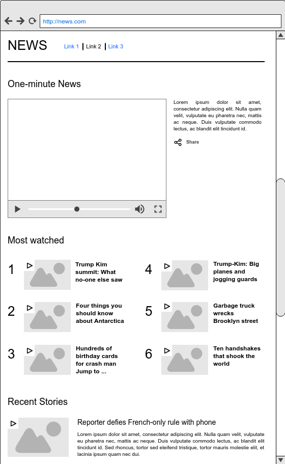
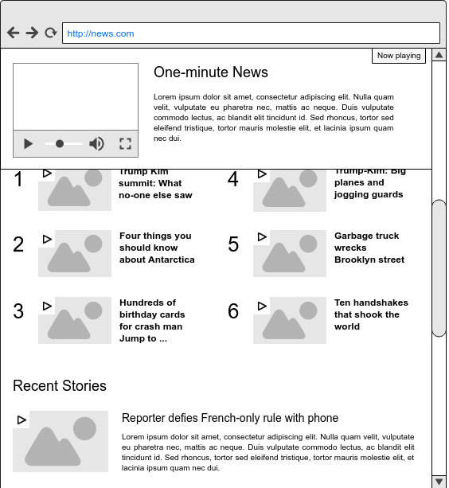

# Video Manager

## Objetivo

Modelar a arquitetura de um elemento de interface que execute vídeos, em uma página web. O elemento de interface deve reagir à alguns eventos provocados pelo usuário final, tal como o scroll da página web. Nos casos em que o usuário realize o scroll sobre a página e o elemento de vídeo, o qual ele tenha iniciado uma execução, saia da perspectiva de visão, esse deve ser fixado em algum quadrante da tela.





## Formalização

Quando trabalhamos com aplicações em JavaScript, devemos ter em mente que o planejamento acerca da arquitetura costuma nos tomar mais tempo do que imaginamos, principalmente quando queremos modelar os itens mais relevantes.

Escolher e definir padrões de projeto nos permite dividir partes de nossa aplicação em pequenos módulos. No entanto, durante a manutenção e evolução de um projeto, devemos nos questionar sobre questões básicas:

- Eu estou evoluindo o código de maneira que seja reutilizável?
- Minhas alterações provocam algum tipo de acoplamento entre módulos ou funcionalidades?
- A minha aplicação é sensível à falhas causadas por novas funcionalidades?
- Meu sistema pode ser testedado em suas pequenas unidades?

Portanto, quando trabalhamos no desenvolvimento e manutenção de aplicações robustas em JavaScript, devemos tem em mente as seguintes qualidades para nosso código: sustentável, extensível, flexível e reutilizável.

## Metodologia

Nesta fase apresentamos alguns detalhes de uma arquitetura para os componentes de interface apresentados anteriormente em **Objetivo**, bem como as trocas de estados durante detecção de scroll.

### Angular

A organização lógica dos componentes nos permite visualizar os elementos potencialmente agrupáveis. Quando trabalhamos com o Angular, por exemplo, esses grupos podem ser reunidos em diretivas.

Primeiro, identificamos os elementos que são utilizados repetidas vezes em diferentes áreas. Isso significa que é desejável ter diversas instâncias desses elementos disponíveis em qualquer área do nosso sistema.

Ao inspeciornamos visualmente as figuras 1 e 2, podemos notar que as informações dos vídeos se repetem nas diferentes áreas do site. Possuímos uma lista para vídeos mais assistidos como também para os vídeos mais recentes.

A figura 2 mostra um outro elemento, dessa vez único na tela, que é o modal de um vídeo em execução cuja a finalidade é manter-se fixo em algum quadrante da tela, permitindo que o usuário *gerencie* o vídeo que se encontrava em execução, antes do evento de scroll.

Logo, nossos candidatos são:
- Componente individual para o vídeo com título, descrição e preview de conteúdo
- Componente de gerência de vídeo para vídeos fora da área de visão do usuário
- Componentes para agrupar vídeos em diferentes listas

Como o objetivo do nosso trabalho é exibir vídeos e gerenciar a execução daqueles que fogem do campo de visão de um usuário, vamos focar nos dois primeiros componentes.

Com base na orientação [(Style Y163)](https://github.com/johnpapa/angular-styleguide/tree/master/a1#style-y163) , propomos o módulo *videos* para agrupar os serviços, controladores e visões da *feature* de vídeos das figuras 1 e 2.

Em seguida, com base na orientação [(Style Y164)](https://github.com/johnpapa/angular-styleguide/tree/master/a1#style-y164) propomos uma diretiva global para a detecção dos eventos associados ao scroll, uma vez que este será um serviço comum aos diferentes itens de vídeos.

O diretório da aplicação deve ter uma estrutura similar a abaixo:

```
utils
    /directives
        - scroll-detect.directive.js
videos
    /directives
        - video-item.directive.js
        - video-manager.directive.js
    /views
        - template-video-item.html
        - template-video-manager.html
```

**scroll-detect.directive.js** : diretiva que agrega eventos associados ao scroll de tela em um elemento. Com ela, é possível detectar se um elemento está visível ou não para o usuário.

**video-item.directive.js** : representação mais simples de um elemento de vídeo. Fornece em uma view dados como o título, descritção e preview.

**video-manager.directive.js** : diretiva responsável por reunir os elementos video-item em uma tela e coordenar o estado de visão daquele que estiver em execução de acordo com a detecção do scroll.

**template-video-item.html** : estrutura html para suporte à diretiva **video-item.directive.js** na visualização do item de vídeo.

**template-video-manager.html** : estrutura html para suporte à diretiva **video-manager.directive.js** na visualização do modal de vídeo, de acordo com deteção do scroll.

**Video Manager Directive**

```
/**
** video-manager.directive.js
**
** @description diretiva responsável por reunir os elementos video-item em uma tela e coordenar o estado de visão daquele que estiver em execução de acordo com a detecção do scroll.
**/
(function(){
'use strict';

angular
	.module('app.videos')
	.directive('videoManager', videoManager);

function videoManager() {

	var ddo={
		scope: {
			/// ...
		},
		restrict:'E',
		controller: VideoManagerController,
		replace: true,
		templateUrl:'app/videos/views/template-video-manager.html'
	}

	return ddo;

	///

	function VideoManagerController($scope, $attrs) {
		$watch('video-item--added-on-page', function(video) {
				// mapear videos adicionados em uma lista de execução
		});

    $watch('video-item--removed-from-page', function(video) {
				// remover video da lista de execução
		});

    $watch('video-item--out-of-view', function(video) {
        // carrega dados do video no template do manager
    });
	}

  /// ... more code
}
})();
```

**Video Item Directive**

```
/**
** video-item.directive.js
**
** @description diretiva que agrega eventos associados ao scroll de tela em um elemento. Com ela, é possível detectar se um elemento está visível ou não para o usuário
**/
(function(){
'use strict';

angular
	.module('app.videos')
	.directive('videoItem', videoItem);

function videoItem() {

	var ddo={
		scope: {
			video:'=video'
		},
		restrict:'E',
		controller: VideoItemController,
		replace: true,
		templateUrl:'app/videos/views/template-video-item.html'
	}

	return ddo;

	///

	function VideoItemController($scope, $attrs) {

		isPlaying = false;

    $emit('video-item--added-on-page', $scope.video);

		$watch('click', function(change) {
					if (isPlaying) {
							$emit('video-item--play', $scope.video);
					} else {
							$emit('video-item--stop', $scope.video);
					}

					isPlaying = !isPlaying;
		});
	}

	function _onDetectedScroll(out_of_view) {

		if (out_of_view) {
      $emit('video-item--out-of-view', $scope.video);
		}

	}

  /// ... more code
}
})();
```
